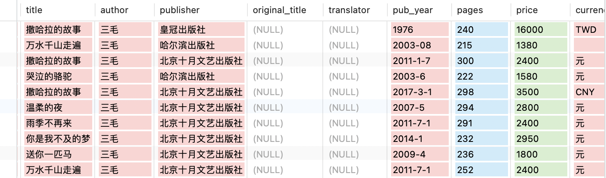
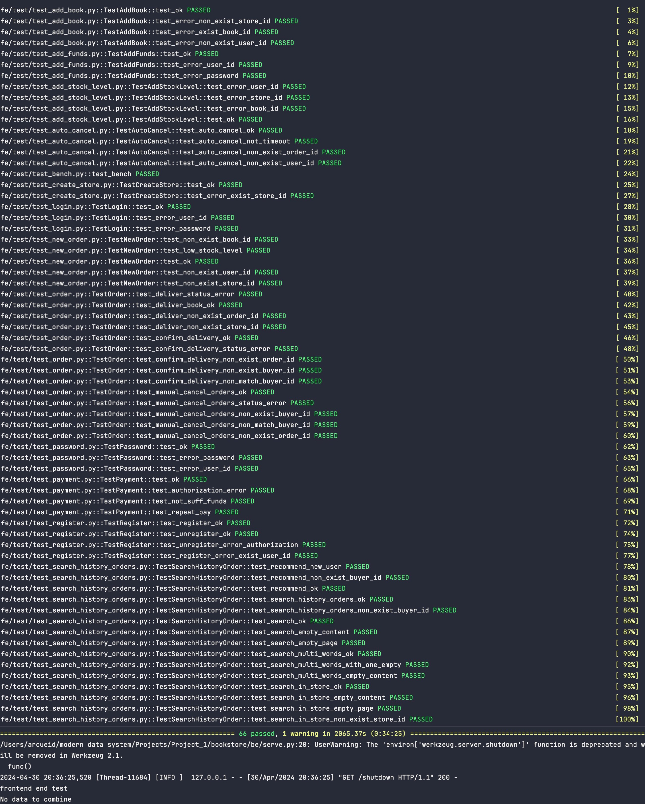
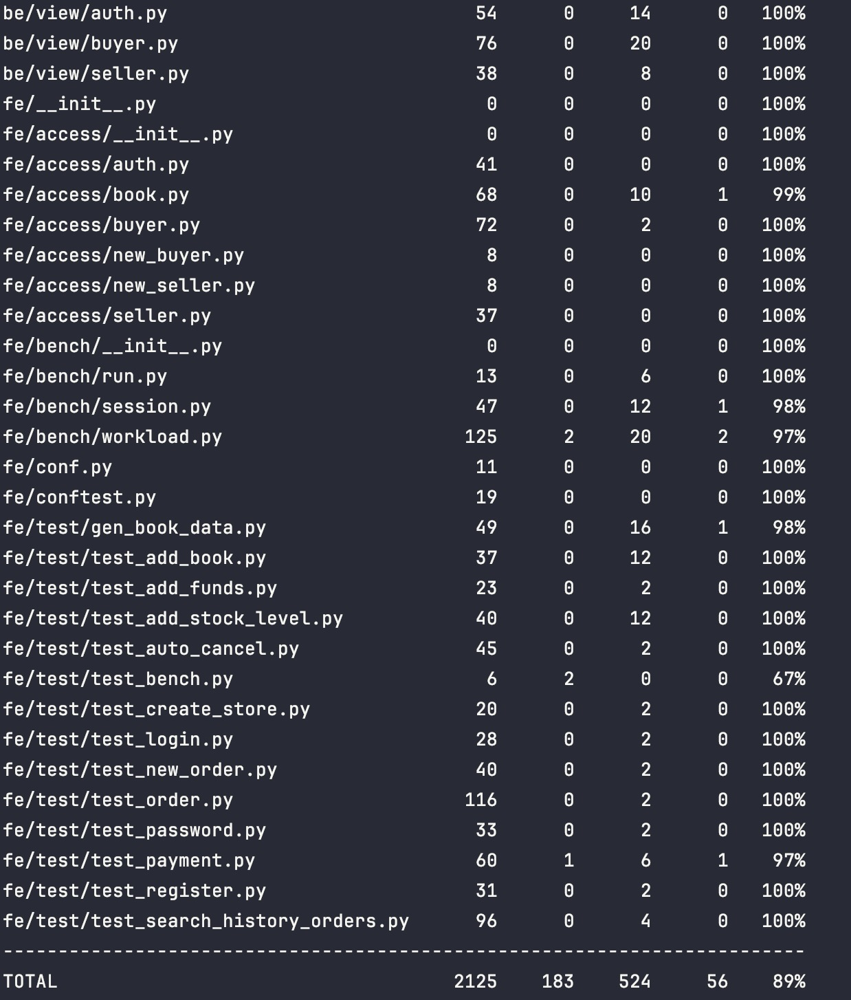
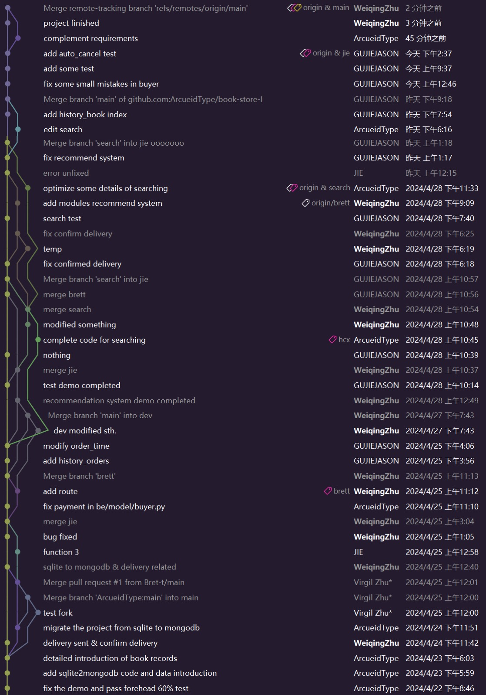

<h1>
    <center>
        CDMS 2024 Spring 
        Team Project - Book Store
    </center>
</h1>


| Team Member | Student ID  |                       Responsibilities                       | Proportion |
| :---------: | :---------: | :----------------------------------------------------------: | :--------: |
| **韩晨旭**  | 10225101440 | Schema 设计、倒排表、基础功能实现、单/多关键词搜索、店内搜索 |   33.4%    |
|  **谷杰**   | 10222140408 |          手动/自动取消订单、查询历史订单、接口测试           |   33.3%    |
| **朱维清**  | 10215300402 |                推荐系统、收货、发货、接口测试                |   33.3%    |

<span style="color:darkorange;">项目仓库：https://github.com/ArcueidType/book-store-I</span>

---

[TOC]

## 一、实验要求

> 实现一个提供网上购书功能的网站后端。
>
> + 网站支持书商在上面开商店，购买者可以通过网站购买；
> + 买家和卖家都可以注册自己的账号；
> + 一个卖家可以开一个或多个网上商店；
> + 买家可以为自已的账户充值，在任意商店购买图书；
> + 支持【下单-->付款-->发货-->收货】流程。

​		提供项目 demo ：bookstore，采用 Flask 后端框架与 SQLite 数据库，实现了前60%功能以及对应的测试用例代码。

​		要求创建本地 MongoDB 数据库，将`bookstore/fe/data/book.db`中的内容以合适的形式存入本地数据库，将原有的 SQLite 数据库操作改写为 MongoDB 数据库命令，后续所有数据读写都在本地  MongoDB 数据库中进行。

1. *基础功能（60%）*：

   + 用户权限接口，如注册、登录、登出、注销；

   + 买家用户接口，如充值、下单、付款；

   + 卖家用户接口，如创建店铺、添加书籍信息及描述、增加库存；
2. *附加功能（40%）*：

   + 实现付款后续流程：*发货* --> *收货*；

   + *搜索图书*：
     用户可以通过*关键字、参数化搜索*，搜索范围包括：题目，标签，目录，内容；
     *全站搜索*，*当前店铺搜索*；
     如果显示结果较大，需要*分页*；
     (使用全文索引优化查找)

   + 订单状态，订单查询，取消定单：
     用户可以*查自已的历史订单*；
     *买家可以主动取消定单*；
     买家下单后，经过一段时间*超时仍未付款，定单自动取消*。
3. 所有功能通过对应的测试：`test_case PASSED` ，尽量提高测试覆盖率，并通过添加索引来提高程序以及本地 MongoDB 数据库的执行性能。

## 二、MongoDB 文档型数据库设计

### 2.1 book

+ `book` collection 用于存储书本信息，每个文档对象储存一本书的信息。
  每个文档对象结构如下（该书没有的或缺失的属性设置为 NULL ）：  

```json
{
  "_id":            "MongoDB给每个文档对象的ObjectID", 
  "id":             "唯一标识每本书的ID",
  "title":          "本书的标题",
  "author":         "本书的作者",
  "publisher":      "本书的出版社",
  "original_title": "外文书的原标题",
  "translator":     "外文书的译者",
  "pub_year":       "本书出版的时间",
  "pages":          "本书的页数",
  "price":          "本书的价格(仅数字)",
  "currency_unit":  "价格对应的货币单位",
  "isbn":           "本书的ISBN号",
  "author_intro":   "本书作者简介",
  "book_intro":     "本书内容简介",
  "content":        "本书的目录",
  "tags":           "本书的标签，关键字等",
  "picture":        "本书的图片"
}
```

- 在 `"id"` 上建立索引，加快查询书的速度；将这些对象存储在一个 collection 中构成所有书本的信息。

+ 部分数据如图：



### 2.2 history_order

+ `history_order` collection 用于存储所有发生过的历史订单；
  每个文档对象对应一条订单。

```json
{
  "_id":            "MongoDB给每个文档对象的ObjectID",
  "order_id":       "唯一标识该订单的ID",
  "user_id":        "该订单的买家ID",
  "store_id":       "该订单的店家ID",
  "status":         "该订单的状态(0表示已取消，1表示下单未付款，2表示已付款，3表示已发货，4表示已确认收货)",
  "total_price":    "该订单的总金额",
  "order_time":     "订单建立时间",
  "books":          "该订单包含书本的数组"
}
```

- 在 `user_id` 建立索引，该集合服务于用户查询信息，因此查询字段为 `user_id`。

### 2.3 new_order

+ `new_order` collection 用于存储所有新建的正在进行中的订单，不包括已经完成或取消的订单；
  每个文档对象对应一条订单。

```json
{
  "_id":            "MongoDB给每个文档对象的ObjectID",
  "order_id":       "唯一标识该订单的ID",
  "store_id":       "该订单的店家ID",
  "user_id":        "该订单的买家ID",
  "status":         "该订单的状态(0表示已取消，1表示下单未付款，2表示已付款，3表示已发货，4表示已确认收货)",
  "total_price":    "该订单的总金额",
  "order_time":     "订单建立时间"
}
```

- 在 `"order_id"` 字段建立索引，在查询时仅使用该字段。

### 2.4 new_order_detail

+ `new_order_detail` collection 用于存储所有 `new_order` 中的订单的详细信息；
  每个文档对象仅对应一个订单中的某一本书的信息。

```json
{
  "_id":            "MongoDB给每个文档对象的ObjectID",
  "order_id":       "唯一标识该订单的ID",
  "book_id":        "该订单中购买的书的ID",
  "count":          "购买该书的数量",
  "price":          "该书的单价"
}
```

- 在 `order_id` 字段建立索引，该集合仅使用该字段查询。

### 2.5 store

+ `store` collection 存储了所有目前存在的店铺信息；
  每个文档对象为某店家某本书对应的信息（该书的ID，价格，库存）。

```json
{
  "_id":            "MongoDB给每个文档对象的ObjectID",
  "store_id":       "该条对象对应的商店ID",
  "book_id":        "该条对象对应的商店在售书籍的ID",
  "price":          "该书的单价",
  "stock_level":    "该书在该商店的库存量"
}
```

- 在 `store_id` 和 `book_id` 字段建立复合索引，结构刚好对应一家店（一个 `store_id` ），其下属的书的 ID ( `book_id` )，在查询时也只使用这两个字段。

### 2.6 user

+ `user` collection 存储了用户相关的信息；
  每个文档对象为一个用户的信息。

```json
{
  "_id":            "MongoDB给每个文档对象的ObjectID",
  "user_id":        "该用户的唯一ID",
  "password":       "该用户的密码",
  "balance":        "该用户的余额数量",
  "token":          "包含最近一次登录信息的token，可以判断登录时间，终端等",
  "terminal":       "记录登录时的终端号"
}
```

- 在 `user_id` 建立索引，查询时只通过该字段获取用户详细信息。

### 2.7 user_store

+ `user_store` collection 存储了用户与商店之间的关系（即哪家店是哪个用户开的）；
  每条文档为一个商店和它的拥有者。

```json
{
  "_id":            "MongoDB给每个文档对象的ObjectID",
  "store_id":       "商店的ID",
  "user_id":        "拥有该店铺的用户的ID"
}
```

- 该表用于找到商店归属于哪个用户，因此在 `store_id` 上建立索引。

### <span style="color:darkorange;">⭐2.8 inverted_index</span>

+ `inverted_index` collection 用于存储**倒排索引**，用于搜索时给出结果；
  每一条文档对象对应一个搜索词的结果。

```json
{
  "_id":            "MongoDB给每个文档对象的ObjectID",
  "search_key":     "用于查询的关键字",
  "search_id":      "唯一且自增标识每一条记录，可应用于分页",
  "book_id":        "该关键词对应书籍的ID",
  "book_title":     "该关键词对应的书籍标题",
  "book_author":    "该关键词对应的书籍作者"
}
```

- 在 **`search_key` **, `book_id` 和 `search_id` 上建立索引，分别用于**搜索时加速**，**判断倒排表中是否已有存在书籍**和分页时排序。

## 三、功能实现

### User 类

#### 3.1.1 基础功能

##### 注册（register）

* **功能实现**

  1. 根据 `user_id` 在 `user` 表中查询用户是否已经存在；

  2. 若不存在，则插入新用户（ `user_id` , `password` , `balance` , `token` , `terminal` ）到 `user` 表中。

* **性能分析**

  一次查询，一次插入，**访问数据库两次**。

* **测试样例**

  `user_id` 已经存在的情况。

  ---

##### 登录（login）

* **功能实现**

  1. 根据 `user_id` 在 `user` 表中获取密码 `password` ；

  2. 将表中获取的 `password` 与输入的 `password` 进行比对；

  3. 若匹配，则更新 `user` 表中用户的 `token` 和 `terminal` 。

* **性能分析**

  一次查询，一次更新，**访问数据库两次**。

* **测试样例**

  `user_id` 不存在；`password` 错误的情况。

  ---

##### 登出（logout）

* **功能实现**

  1. 根据 `user_id` 在 `user` 表中获取 `token` 并获取 `token` ；

  2. 将传入的 `token` 与获取的 `token` 进行比较；

  3. 若匹配，计算当前时间与 `token` 中的时间戳的差值，检查是否在指定的 `token` 生命周期内；

  4. 若在，即验证成功，并更新 `token` 。

* **性能分析**

  一次查询，一次更新，**访问数据库两次**。

* **测试样例**

  `user_id` 不存在；`token` 错误的情况。

  ---

##### 注销（unregister)

* **功能实现**

  1. 根据 `user_id` 在 `user` 表中查询用户是否已经存在；

  2. 若存在，则根据 `user_id` 删除 `user` 表中该用户条目。

* **性能分析**

  一次查询，一次删除，**访问数据库两次**。

* **测试样例**

  `user_id `不存在； `password` 错误的情况。

  ---

##### 更改密码（change_password）

* **功能实现**

  1. 根据 `user_id` 在 `user` 表中查询用户的旧密码并与输入的 `old_password` 进行比较；

  2. 若匹配，则将 `user` 表中 `password `更新为 `new_password `。

* **性能分析**

  一次查询，一次更新，**访问数据库两次**。

* **测试样例**

  `user_id` 不存在；`old_password` 错误的情况。

  ---

#### 3.1.2 附加功能

##### 查询历史订单（search_history_orders）

* **功能实现**

  1. 通过查询 `user` 表判断传入的 `user_id` 是否存在；

  2. 根据 `user_id ` 查询 `history_order ` 表中的该用户的历史订单。

* **性能分析**

  一次查询，**访问数据库一次**。

* **测试样例**

  `user_id` 不存在的情况。

  ---

##### <span style="color:darkorange;">⭐推荐系统（recommend_generate）</span>

> + 对 `User` 类的对象提供书籍推荐功能，采用**物品协同过滤算法（ItemCF--IUF）**，通过分析所有用户的购书记录建立书籍的 `tags` 的共现矩阵来计算 `tags` 之间的相似度，根据高相似度 `tags` 与用户购买过书籍的 `tags` 的交集的相似值求和后排序，筛选出在售的书籍推荐给目标用户。
>
> + **ItemCF--IUF相似度矩阵计算公式：**
>   $$
>   W_{\mu\nu} = \frac{\displaystyle\sum_{i\in N(\mu) \cap N(\nu)} \frac{1}{\log(1+|N(i)|)}}{\sqrt{|N(\mu)||N(\nu)|}}
>   $$
>
> + **归一化处理：**
>
> $$
> w^{\prime}_{ij}=\frac{w_{ij}}{\max_j{w_{ij}}}
> $$
>
> + 推荐书籍时的三种情况：
>   1. **冷启动**：book store刚开始运行，**`history_order` 表为空，默认随机推荐 1 - 10 本在售书籍**；
>   2. 用户为**新用户，没有购书记录，默认推荐 1 - 10 本销量最高的在售书籍**；
>   3. 用户**有购书记录，推荐 1 - 10 本 `tags` 相似度最高的在售书籍**。

* **功能实现**

  1. 判断 `user_id` 是否存在；

  2. `tags` 为 `string` 类型，通过建立二维字典来实现 `tags` 的共现矩阵。
     以下为推荐算法中的重要变量：

     ```python
     # 所有用户购买过的书的 tags
     users_tags = defaultdict(set)	
     
     # 所有用户各自购买过的书，用于遍历历史订单的"books"字段时判断是否购买过，若购买过则在共现矩阵中更新过该书的 tags，continue
     users_books = defaultdict(set)		
     
     # 所有书的 tags，用于获得 tags 相似度后寻找相似度最高的书籍
     all_books_tags = defaultdict(set)	
     
     # 推荐目标用户的购书记录，用于判断推荐出的书籍是否购买过，若是，则不推荐，推荐相似度更低的下一本书籍
     target_user_history = set()			
     
     # 所有推荐的书籍，包含每本书籍的book_id、title、author、tags(、相似度sim_value)
     recommend_books = []
     recommend_books_id = []
     
     # 通过所有购书记录获取的销量排行榜
     best_selling_rank = defaultdict(int)
     
     # 每个tag被所有user购买过book的tags的匹配次数总和，即共现矩阵
     tag_total_matched = defaultdict(int)
     
     # tags的相似度矩阵
     tag_sim_matrix = defaultdict(dict)
     ```

  3. 判断是否是**冷启动**的情况，若**`history_order` 表为空，随机推荐 1 - 10 本在售书籍**。
     通过对 ` store` 表的所有在售书籍进行聚合操作，筛选出 1 - 10 本书籍进行推荐：

     ```python
     books_on_sale = self.db['store']
     total_books = books_on_sale.count_documents({})
     sample_size = min(total_books, 10)
     match_cond = {"stock_level": {"$gt": 0}}
     pipeline = [
         {"$match": match_cond},
         {"$sample": {"size": sample_size}}
     ]
     random_books = list(books_on_sale.aggregate(pipeline))
     for book in random_books:
     if book['book_id'] in recommend_books_id:
         continue
     recommend_books_id.append(book['book_id'])
     ```

  4. 遍历 `history_orders` 表，生成 User--Tag 表，并更新 `best_selling_rank` 和 `target_user_history` ；

  5. 判断用户是否为**新用户，若没有购书记录，推荐 1 - 10 本销量最高的在售书籍**；

  6. 通过 `users_tags` 和 `tag_total_matched` 计算相似度矩阵 `tag_sim_matrix` ，并**增加 IUF 参数**后转化为 `tagSimMatrix`：

     ```python
     for user, tags in users_tags.items():
         for tag in tags:
             tag_sim_matrix.setdefault(tag, dict())
             tag_total_matched[tag] += 1
             for tag_k in tags:
                 if tag == tag_k:
                     continue
                 tag_sim_matrix[tag].setdefault(tag_k, 0)
                 tag_sim_matrix[tag][tag_k] += (1. / math.log1p(len(tags) * 1.))
     
     tagSimMatrix = defaultdict(dict)
     for tag, related_tags in tag_sim_matrix.items():
         for tag_k, value in related_tags.items():
             tagSimMatrix[tag][tag_k] = value / math.sqrt(tag_total_matched[tag] * tag_total_matched[tag_k])
     ```

  7. 对相似度矩阵 `tagSimMatrix` 进行**归一化**：

     ```python
     for tag, related_degrees in tag_sim_matrix.items():
         max_degree = max(related_degrees.values())
         tagSimMatrix[tag] = {k: v / max_degree for k, v in related_degrees.items()}
     ```

  8. 寻找相似度最高的 10 个 `tag` ：

     ```python
     recommend_tags = dict()
     target_user_tags = users_tags[user_id]
     for tag in target_user_tags:
         for i, sim in sorted(tagSimMatrix[tag].items(), key=itemgetter(1), reverse=True)[:20]:
             # 这里筛选的结果保留user购买过的书籍包含的tags
             # if i in target_user_tags:
             #     continue
            recommend_tags.setdefault(i, 0.)
            recommend_tags[i] += sim
            recommend_tags = dict(sorted(recommend_tags.items(), key=itemgetter(1), reverse=True)[:10])
     ```

  9. 通过之前记录的 `all_books_tags` 字典中每本书的 `tags` 与筛选出的高相似度 `recommend_tags` 做交集，若有交集，则**求和交集部分的 `tags` 的相似度**，并把相似度 `sim_value` 记录在`recommends`里，由此得到至多 10 本筛选出的推荐书籍：

     ```python
     recommends = []
     key_tags = set(recommend_tags.keys())
     for book_id, tags in all_books_tags.items():
         intersection = tags.intersection(key_tags)
         if intersection:
             sim_value = sum(recommend_tags[tag] for tag in intersection)
             recommends.append([book_id, tags, sim_value])
     recommends = sorted(recommends, key=lambda x: x[2], reverse=True)[:10]
     ```

  10. 根据 `recommends` 里筛选出书籍的 `book_id` 查找 `book` 表获得其他书籍信息，判断目标用户是否未购买过该书，且该书是否在售，若均是，则将该书籍的详细信息与 `sim_value` 加入到最终返回值 `recommend_books` 里；

  11. 若之前操作结束后的 `recommend_books` 为空，考虑到推荐出的 10 本书可能目标用户全都买过的情况，推荐 1 - 10 本当前销量最高且在售的书籍给目标用户。
      **推荐结束。**

* **性能分析**

  需多次访问多张表，数据库操作较多。

* **测试样例**

  新用户推荐是否成功；`buyer_id` 不存在的情况；老用户推荐是否成功。


---

### Buyer 类

#### 3.2.1 基础功能

##### 下单（new_order)

* **功能实现**

  1. 检查 `user_id` ， `store_id` 是否存在；

  2. 若存在，根据 `user_id` ， `store_id` 和 `uuid` 构造 `order_id` ；

  3. 根据 `store_id `和 `book_id` 查询每本书的 `stock_level` 和 `price` ；

  4. 判断库存是否充足，若充足，更新 `store` 表中对应书籍的库存，即在原来的基础上减去购买的数量；

  5. 在 `new_order_detail `中对于每一本书插入一条数据（包含 `order_id` , `book_id` , `count` 和`price` ）并将 单价*数量 累加到 `total_price` ；

  6. 每本书都插入完成后，在 `new_order `中插入一条数据（包含 `order_id` , `store_id` , `user_id` , `status` , `total_price` 和 `oreder_time` )；

  7. 同时也要往 `history_order` 表中插入类似的一条数据（比 `new_order` 多了 `books` ）。

* **性能分析**

  假设要购买 k 种书，则需要查询 k+2 次，插入 k+2 次，**访问数据库 2*k+4 次**。

* **测试样例**

  `user_id` , `book_id` 和 `store_id` 不存在的情况；库存不够的情况。

---

##### 付款（payment)

* **功能实现**

  1. 根据 `order_id` 在 `new_order` 表查询 `user_id` , `store_id` , `status` 和 `total_price` ；

  2. 判断是否成功查询、检查状态以及 `buyer_id` 是否与 `user_id` 相匹配；

  3. 判断现在距离下单时间是否超过 `time_minute` ，若超过，则执行**取消订单**的流程；

  4. 根据 `user_id` 在 `user` 表中查询 `balance` 和 `password` ，并检查密码是否匹配；

  5. 更新 `user` 表中的 `balance` ，即减去 `total_price` ；

  6. 更新 `new_order` 和 `history_order` 中的 `status` ，将其改为2，即已付款未发货。

* **性能分析**

  四次查询，三次更新，**访问数据库七次**。

* **测试样例**

  `password` 不匹配；余额 `balance` 不足；重复付款（ `status` 不对）的情况。

  ---

##### 充值（add_funds)

* **功能实现**

  1. 根据 `user_id` 在 `user `表中查询 `balance` 和 `password` ，并检查密码是否匹配；

  2. 若匹配，更新 `user `表中用户的 `balance` ，即加上充值的金额 `add_value` 。

* **性能分析**

  一次查询，一次更新，**访问数据库两次**。

* **测试样例**

  ` password` 不匹配的情况； `user_id` 不存在的情况。

  ---

#### 3.2.2 附加功能

##### 手动取消订单（manual_cancel_orders）

* **功能实现**

  1. 即执行**取消订单**的流程；

  2. 判断 `user_id` 和 `order_id` 是否存在；

  3. 根据 `order_id` 在 `new_order` 表查询 `user_id` , `store_id` , `status` 和 `total_price` ；

  4. 判断是否成功查询、检查状态以及 `buyer_id` 是否与 `user_id` 相匹配；

  5. 更新` history_order` 表中的 `status` ，将其设为 0；

  6. 对于每一种书，都更新 `store` 表中对应 `store_id` 和 `book_id` 的 `stock_level` ，即更新库存；

  7. 删除 `new_order` 和 `new_order_detail` 中的对应条目。

* **性能分析**

  假设原来购买 k 种书，四次查询，两次删除，k+1 次更新，**访问数据库 k+7 次**。

* **测试样例**

  `status` 是否正确，是否是已下单未付款的订单； `order_id` ，`buyer_id` 是否存在的情况；`order_id`，`buyer_id`不匹配的情况

  ---

##### 收货（confirm_delivery）

* **功能实现**

  1. 判断 `user_id` 和 `order_id` 是否存在；
  2. 根据 `order_id` 在 `new_order` 表查询对应订单，提取出该订单的所有信息；
  3. 判断订单的 `user_id` （订单买家）是否和传入的 `user_id` （收货买家）是否相等，并判断订单的 `status` 是否为 3；
  4. 通过订单的 `store_id` 在 `user_store` 表中查找店主 `seller_id`，并判断是否存在；
  5. 更新 `user` 表中店主的余额；
  6. 更新 `history_order` 表中该订单的 `status` 为 4；
  7. 删除 `new_order` 和 `new_order_detail` 表中该订单 `order_id` 对应的数据，确认收货成功。

* **性能分析**

  两次查询，两次更新，两次删除，**访问数据库 6 次**。

* **测试样例**

  是否确认收货成功；订单状态码 `status` 是否为 3；`order_id` ，`buyer_id` 是否正确以及是否匹配。

  ---

##### <span style="color:darkorange;">⭐自动取消订单（auto_cancel_orders）</span>

* **功能实现**

  1. 判断 `user_id` 和 `order_id` 是否存在；

  2. 判断现在距离下单时间是否超过 `time_minute` ，若超过，则执行**取消订单**的流程；

  3. 利用 `BlockingScheduler` 调度器**，实现每隔一段时间检查一次；

  4. 取消订单的功能还基于一个全局字典 `unpaid_orders` ，里面存储着每个下单未付款的 `order_id` 以及对应的下单时间，每次下单时便会插入，取消或付款后便会弹出。

* **性能分析**

  假设原来购买 k 种书，两次查询，两次删除，k+1 次更新，**访问数据库 k+5 次**。

* **测试样例**

  超时自动取消，未超时以及 `user_id` ，`order_id` 不存在的情况。

  ---

##### <span style="color:darkorange;">⭐单关键词搜索（search）</span>

- **功能实现**

  1. 读取前端传回参数，`page` 为 0 则不分页，`page` 不为 0 则表示请求页号；
  2. 通过传回的关键词，与 `inverted_index` 中 `search_key` 匹配，获取查找结果；
  3. 若 `page` 为 0，则直接返回所有结果，若需要分页，则计算出页面开始处，返回规定的 `page_size` 条结果。

  ```python
          page_start = self.page_size * (page - 1)
          rows = inverted_index_col.find(
              {'search_key': search_key},
              {'_id': 0,
              'book_id': 1,
              'book_title': 1,
              'book_author': 1}
          ).sort({'search_id': 1}).limit(self.page_size).skip(page_start)
  ```

- **性能分析**

  **仅需访问一次数据库**，并且 `search_key` 和 `search_id` 上都建有索引，因此**搜索效率较高**。

+ **测试样例**

  可以搜索到结果的搜索内容；无法搜索到结果的搜索内容；分页搜索。

  ---

##### <span style="color:darkorange;">⭐多关键词搜索（search_multi_words）</span>

- **功能实现**

  1. 对于给出关键词的列表中的每个关键词，都进行单关键词搜索并合并结果；
  2. 对结果进行去重，将结果返回。

- **性能分析**

  根据关键词数量影响效率，有 n 个关键词则访问 n 次`inverted_index`，同单关键词搜索，**效率较高**。

- **测试样例**

  所有关键词均可以得到结果的关键词列表；部分关键词不能得到结果的关键词列表；所有关键词都不能得到结果的关键词列表。

  ---

##### <span style="color:darkorange;">⭐店内搜索（search_in_store）</span>

- **功能实现**

  1. 读取前端传回参数，`page` 为 0 则不分页，`page` 不为 0 则表示请求页号；
  2. 通过传回的关键词，在 `store` 和 `inverted_index` 连接的表中用 `search_key` 和 `store_id` 匹配，获取查找结果；
  3. 若 `page` 为 0，则直接返回所有结果，若需要分页，则计算出页面开始处，返回规定的 `page_size` 条结果。

  ```python
  page_start = self.page_size * (page - 1)
  rows = inverted_index_col.aggregate([{'$lookup': {
                                        'from': 'store',
                                        'localField': 'book_id',
                                        'foreignField': 'book_id',
                                        'as': 'search_doc'}},
                                       {'$project': {
                                        'search_doc.store_id': 1,
                                        'search_key': 1,
                                        'search_id': 1,
                                        'book_id': 1,
                                        'book_title': 1,
                                        'book_author': 1,
                                        '_id': 0}},
                                       {'$match': {
                                        'search_key': search_key,
                                        'search_doc.store_id': store_id}},
                                       {'$sort': {'search_id': 1}},
                                       {'$skip': page_start},
                                       {'$limit': self.page_size}])
  ```

- **性能分析**

  只访问一次数据库，使用了连接，但搜索字段均有索引，因此**搜索效率也较高**。

- **测试样例**

  可以查到结果的关键词和店铺 ID；搜索结果为空的关键词和店铺 ID；分页搜索；查找不存在的店铺。

---

### Seller 类

#### 3.3.1 基础功能

##### 创建店铺（create_store）

* **功能实现**

  1. 通过查询 `user` 表和 `store` 表判断传入的 `user_id` 和 `store_id` 是否存在；

  2. 若存在根据传入的 `user_id` 和 `store_id` 在 `user_store` 表中插入一条店铺信息。

* **性能分析**

  两次查询，一次插入，**访问数据库三次**。

* **测试样例**

  `user_id` ，`store_id` 不存在的情况。

  ---

##### 增加库存（add_stock_level）

* **功能实现**

  1. 检查 `user_id` ，`store_id` ，`book_id` 是否存在；

  2. 若存在，更新 `store` 表中对应店铺中的对应书籍的库存（ `stock_level` )，再原基础上加上传入的 `add_stock_level` 。

* **性能分析**

  两次查询，一次更新，**访问数据库三次**。

* **测试样例**

  `user_id` ，`store_id` ， `book_id` 不存在的情况。

  ---

##### <span style="color:darkorange;">⭐上架图书（倒排表建立）（add_book)</span>

* **功能实现**

  1. 检查 `user_id`，`store_id`，`book_id` 是否存在；
  2. 判断该 `book_id` 是否已经存在于表中，**若存在则跳过，无需重新加入**；
  3. **分离 `author` 中的作者和国籍（有的内容有括号标注国籍），将书籍简介、作者简介、目录进行分词，加入到 `tags` 中**；
  4. **将标题分词，从后往前逐步连接并获取每步的所有前缀，合并上原标题等可能存在的信息的所有前缀以及 `tags` ，最后进行去重，得到该书所有的 `search_key`**；
  5. **将数据逐一插入 `inverted_index`** ；
  6. 将店家和书等相关信息插入 `store` 。

  ```python
              if not list(cursor):
                  country, author = '', ''
                  if 'author' in book_json.keys():
                      author = book_json.get('author')
                      country, author = parse_country_author(author)
                  tags = []
                  if 'tags' in book_json.keys():
                      tags = book_json.get('tags')
                  if 'author_intro' in book_json.keys():
                      tags += get_keywords(book_json.get('author_intro'))
                  if 'book_intro' in book_json.keys():
                      tags += get_keywords(book_json.get('book_intro'))
                  if 'content' in book_json.keys():
                      tags += get_keywords(book_json.get('content'))
                  tags = list(set(tags))
  
                  prefixes = []
                  title = book_json.get('title')
                  prefixes += get_words_suffix(title)
  
                  if author != '':
                      names = parse_name(author)
                      for i in range(1, len(names)):
                          prefixes += get_prefix(names[i])
                      prefixes += get_prefix(author)
                  if 'original_title' in book_json.keys():
                      prefixes += get_prefix(book_json.get('original_title'))
                  if 'translator' in book_json.keys():
                      translator = book_json.get('translator')
                      names = parse_name(translator)
                      for i in range(1, len(names)):
                          prefixes += get_prefix(names[i])
                      prefixes += get_prefix(translator)
                  if country != '':
                      prefixes += [country]
                  if tags:
                      prefixes += tags
                  prefixes = list(set(prefixes))
  
                  for prefix in prefixes:
                      cur_search_id = self.db['inverted_index'].count_documents({}) + 1
                      inverted_index_col.insert_one({'search_key': prefix,
                                                    'search_id': cur_search_id,
                                                    'book_id': book_id,
                                                    'book_title': title,
                                                    'book_author': author})
  ```

  > 用到的部分函数实现位于 `be/model/utils.py` 中。

* **性能分析**

  ​		由于每本书都会产生几十甚至上百条 `search_key` ，所以该方法要访问数据库几十甚至上百次，*建立的性能并不友好*，但是倒排表是 **冷数据** ，一次建立好以后就不需要再重新变更，因此**当所有书都拥有倒排表数据后，性能会大大提升**。

* **测试样例**

  可以正常上架的书籍数据；商店不存在；书本不存在；用户不存在。

  ---

#### 3.3.2 附加功能

##### 发货（deliver_book）

* **功能实现**

  1. 判断 `store_id` 和 `order_id` 是否存在；
  2. 通过 `order_id` 在 `new_order` 表中查询订单状态码 `status` ，并判断是否为 2；
  3. 修改 `new_order` 和 `history_order` 中对应 `order_id` 的 `status` 为 3， 并判断是否修改成功，若修改成功，则发货成功。

* **性能分析**

  一次查询，两次更新，**访问数据库三次**。

* **测试样例**

  订单状态码 `status` 是否正确；是否发货成功；`order_id`，`store_id` 是否存在的情况。

## 四、测试情况

+ **pytest 测试结果**：

  1. 共66个测试全部<span style="color:darkorange;"> PASSED</span>
  2. 耗时约34分钟（原因是 `book` 集合共有 43988 个书籍文档，数据量大，使得 test 耗时略长）
     
  3. 唯一的 Warning 是本项目要求环境配置的库版本问题，与本项目功能实现效果无关。

  

+ **coverage 测试结果**：代码覆盖率约为 **89%**

  

## 五、Git 版本管理


