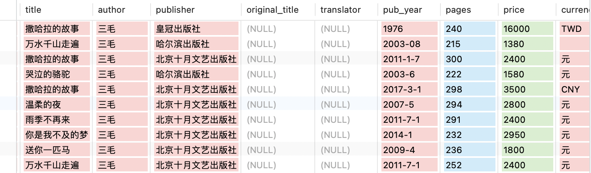

# CDMS 2024 Spring

# Book Store

# Report

## 文档型数据库设计(MongoDB): 

将书本信息存储在一个collection中，每个文档对象储存一本书的信息

每个文档对象结构如下(该书没有的或缺失的属性设置为NULL)：

```json
{
  "_id":            "MongoDB给每个文档对象的ObjectID", 
  "id":             "唯一标识每本书的ID",
  "title":          "本书的标题",
  "author":         "本书的作者",
  "publisher":      "本书的出版社",
  "original_title": "外文书的原标题",
  "translator":     "外文书的译者",
  "pub_year":       "本书出版的时间",
  "pages":          "本书的页数",
  "price":          "本书的价格(仅数字)",
  "currency_unit":  "价格对应的货币单位",
  "isbn":           "本书的ISBN号",
  "author_intro":   "本书作者简介",
  "book_intro":     "本书内容简介",
  "content":        "本书的目录",
  "tags":           "本书的标签，关键字等",
  "picture":        "本书的图片"
}
```

将这些对象存储在一个collection中即构成了所有书本的信息

部分数据如图：


